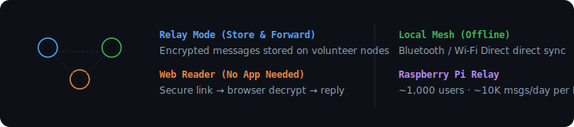

<div align="center">

# ⬡ M E S H T O U C H
### *Encrypted Messaging & Hybrid Relay Network.*

[]()
[](docs/SECURITY.md)
[](LICENSE)

**[🌐 Web Reader](https://earnerbaymalay.github.io/sideload/meshtouch/)** · **[🌐 Sideload Hub](https://earnerbaymalay.github.io/sideload/)** · **[📖 Usage Guide](docs/USAGE.md)** · **[🔧 Troubleshooting](TROUBLESHOOTING.md)**

</div>

---



## What is MeshRelay?

**Encrypted messaging that works without both parties having the app.** Three modes: relay (store-and-forward on volunteer nodes), web reader (non-users get a secure browser link), and local mesh (Bluetooth/Wi-Fi Direct when offline). Relays handle only ciphertext.

---

## Quick Start

### Run a Relay

```bash
git clone https://github.com/earnerbaymalay/meshtouch.git
cd meshtouch/relay-daemon
cp config.example.toml config.toml
cargo run --release
```

### Store a Message

```bash
curl -X POST http://localhost:8080/api/v1/messages \
  -H "Content-Type: application/json" \
  -d '{"recipient_id":"user-uuid","sender_id":"sender-uuid","ciphertext":"base64-data","sender_ratchet_key":"hex-key","msg_num":1}'
```

### Web Reader

Non-users open: `https://relay.meshtouch.link/r/{message_id}#key={key}&iv={iv}`
The encryption key is in the URL fragment — browsers never send it to servers.

---

## How It Works

```
Alice (app) --encrypted--> Relay --encrypted--> Bob (app)
                                        |
                                        v
                                Carol (no app)
                                receives link → opens in browser
```

| Mode | Description |
|------|-------------|
| **Relay** | Encrypted messages stored on volunteer nodes. Recipients retrieve when online. |
| **Web Reader** | Non-users get secure link via SMS/email. Decrypt in browser, no app needed. |
| **Local Mesh** | Bluetooth/Wi-Fi Direct sync when internet unavailable. |

---

## Relay API

| Method | Endpoint | Description |
|--------|----------|-------------|
| POST | `/api/v1/register` | Register a public key |
| POST | `/api/v1/messages` | Store encrypted message |
| GET | `/api/v1/messages/{id}` | Fetch pending messages |
| POST | `/api/v1/messages/{id}/ack` | Acknowledge delivery |
| POST | `/api/v1/relay/forward` | Forward between relays |
| GET | `/api/v1/health` | Health check |

---

## Trust Model

- **Relays see only ciphertext** — never plaintext, keys, contacts, or identities.
- **Web reader** does client-side decryption via Web Crypto API.
- **URL fragment** (`#`) never sent to servers by browsers.

---

## Related Projects

<div align="center">

| Project | Platform | Description | Link |
|---------|----------|-------------|------|
| 🛡️ **Cyph3rChat** | 📱 Android | E2E encrypted messaging (Double Ratchet) | [Source →](https://github.com/earnerbaymalay/e2eecc) |
| 🌌 **Aether** | 📱 Android (Termux) | Local-first AI workstation | [Source →](https://github.com/earnerbaymalay/aether) |
| 📲 **Sideload Hub** | 🌐 Web / PWA | Central app distribution | [Open Hub →](https://earnerbaymalay.github.io/sideload/) |

</div>

---

## Documentation

- **[📖 Usage Guide](docs/USAGE.md)** — Relay setup, web reader, Raspberry Pi deployment.
- **[🔧 Troubleshooting](TROUBLESHOOTING.md)** — Common relay issues, build fixes.
- **[🗺️ Roadmap](docs/ROADMAP.md)** — Mobile app, SMS gateway, public relay registry.
- **[🔒 Security](docs/SECURITY.md)** — Threat model, encryption details.

---

[MIT License](LICENSE)
